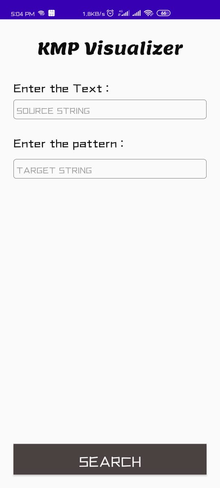

# KMP-Visualiser :eye_speech_bubble:
Welcome to KMP visualiser!! </br>

## All about KMP-Visualiser
- It helps in understanding, the working of KMP Algorithm.
- User needs to add a source string and a target string.
- This algorithm helps in searching the target string in the source string.
- Yellow color in the source string depicts that the target string is found.
- Red color depicts comparision between each letter of the two strings.
- Target String moves with the source string to visualise algorithm effectively.


## KMP Algorithm
- In computer science, the Knuth–Morris–Pratt string-searching algorithm (or KMP algorithm) searches for occurrences of a "word" W within a main "text string" S by employing the observation that when a mismatch occurs, the word itself embodies sufficient information to determine where the next match could begin, thus bypassing re-examination of previously matched characters.
- Time Complexity is O(n).

## APPLICATION DISPLAY  :eyes:	
<kbd></kbd>


## Getting Started :+1:

These instructions will get you a copy of the project up and running on your local machine for development and testing purposes. See deployment for notes on how to deploy the project on a live system.

### Prerequisites

What things you need to install the software and how to install them

```
Things you need to install this mobile aplication->
1. Android Mobile
That's it!
```

### Installing

A step by step series of examples that tell you how to get a development env running

Say what the step will be

```
You can Download the application using below link-
https://github.com/The-Lazy-People/KMP-Visualiser
```

## Built With :heartbeat:

* Android Studio
* Kotlin

## Contributing

All kinds of contribution :heart_eyes: are welcomed.
- <a href="https://github.com/The-Lazy-People/KMP-Visualiser/pulls"> Make a Pull request </a>
- <a href="https://github.com/The-Lazy-People/KMP-Visualiser/issues"> Open Issue </a>

## Authors

* <a href="https://www.linkedin.com/in/abhishek-yadav-aps/"> **Abhishek Yadav** </a> 
* <a href="https://www.linkedin.com/in/2001adarshsingh/"> **Adarsh Singh** </a> 
* <a href="https://www.linkedin.com/in/ayushi-doshi-731210191/">  **Ayushi Doshi** </a>
